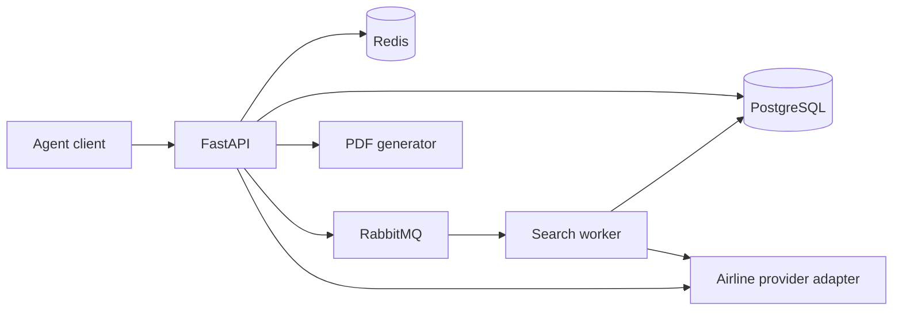

# Ioka Flight Booking API

Тестовое задание: REST API для поиска авиабилетов, бронирования, списания баланса агента и выпуска PDF-билета.

## Что реализовано

- JWT Bearer-аутентификация агента и проверка владельца ресурсов.
- Поиск IATA-кодов и асинхронный поиск предложений с polling.
- Таймауты внешнего провайдера и статусы `PENDING`, `IN_PROGRESS`, `COMPLETED`, `FAILED`, `TIMED_OUT`.
- Детали тарифа, семейство тарифа и багаж.
- Идемпотентное создание заказа в статусе `BOOKED`.
- Идемпотентный выпуск билета с атомарным hold/capture/release баланса.
- Получение заказа и PDF-билета.
- Аудит вызовов провайдера и всех переходов статусов.
- Redis-кэш поиска, RabbitMQ worker и PostgreSQL в Docker Compose.
- Alembic-миграция, OpenAPI/Swagger, unit/integration-тесты.

В проекте используется детерминированный `MockAirlineProvider`, поэтому решение запускается без ключа платного API. Контракт провайдера находится в `app/domain/provider.py`; интеграция с реальным GDS/агрегатором добавляется отдельным адаптером без изменения прикладной логики.

## Архитектура



Слои:

- `app/api` — HTTP-контракты, JWT dependencies и маршруты;
- `app/application` — сценарии поиска, бронирования, выпуска и PDF;
- `app/domain` — статусы и порт авиапровайдера;
- `app/infrastructure` — SQLAlchemy, Redis, RabbitMQ, аудит и mock-провайдер.

## Быстрый запуск в Docker

```bash
docker compose up --build
```

После старта:

- Swagger UI: <http://localhost:8000/docs>
- OpenAPI JSON: <http://localhost:8000/openapi.json>
- readiness: <http://localhost:8000/health/ready>
- RabbitMQ UI: <http://localhost:15672> (`guest` / `guest`)

Тестовый агент:

```text
agent@ioka.local
ChangeMe123!
```

Файл `.env.docker` содержит только локальные значения. Перед production-деплоем обязательно передайте секреты через Vault/Kubernetes Secrets и смените `JWT_SECRET` и пароль агента.

## Локальный запуск без Docker

Локальный режим использует SQLite и inline background task; Redis недоступен — кэш мягко деградирует и не ломает запрос.

```powershell
python -m venv .venv
.\.venv\Scripts\python.exe -m pip install -e ".[dev]"
.\.venv\Scripts\python.exe -m uvicorn app.main:app --reload --port 8010
```

Swagger будет доступен на <http://localhost:8010/docs>.

## Полный API-flow

Сначала получите токен:

```bash
curl -X POST http://localhost:8000/travel/auth/agent/login \
  -H "Content-Type: application/json" \
  -d '{"email":"agent@ioka.local","password":"ChangeMe123!"}'
```

Дальнейшая последовательность:

1. `GET /travel/avia/locations?q=tas`
2. `POST /travel/avia/offers`
3. `GET /travel/avia/offers/search/{search_id}` до `COMPLETED`
4. `GET /travel/avia/offers/{offer_id}`
5. `POST /travel/avia/orders` с уникальным `Idempotency-Key`
6. `POST /travel/avia/orders/{order_id}/issue` с уникальным `Idempotency-Key`
7. `GET /travel/avia/orders/{order_id}`
8. `GET /travel/avia/orders/{order_id}/ticket`

Пример тела поиска:

```json
{
  "origin": "TAS",
  "destination": "IST",
  "departure_date": "2026-10-20",
  "adults": 1,
  "cabin_class": "ECONOMY"
}
```

Пример создания заказа:

```json
{
  "offer_id": "UUID_FROM_SEARCH",
  "passenger": {
    "first_name": "Ali",
    "last_name": "Karimov",
    "birth_date": "1990-01-01",
    "document_number": "AA1234567",
    "document_expiry": "2030-01-01",
    "citizenship": "UZ"
  }
}
```

## Идемпотентность и деньги

`POST /orders` сохраняет хэш тела вместе с `Idempotency-Key`. Повтор с тем же телом возвращает исходный заказ, а повтор с другим телом получает `409 Conflict`.

Выпуск билета выполняется в три шага:

1. В транзакции блокируются агент и заказ, сумма снимается с доступного баланса и создаётся `HELD`-операция.
2. Провайдер вызывается вне долгой DB-транзакции с тем же idempotency key.
3. При успехе операция становится `CAPTURED`, заказ — `ISSUED`; при ошибке сумма возвращается, операция становится `RELEASED`, заказ возвращается в `BOOKED`.

Это исключает двойное списание и позволяет безопасно повторить запрос после сетевого сбоя.

## Проверка качества

```powershell
.\.venv\Scripts\python.exe -m ruff check .
.\.venv\Scripts\python.exe -m pytest -q
```

Тесты проверяют JWT, идемпотентность создания заказа, однократное списание, возврат средств при отказе провайдера, успешный поиск и внешний таймаут.
